Infrastructure Visualization

# 1. Traffic Flow Diagram (Mermaid)

This diagram shows how a user request travels through the AWS resources to reach the application.

```mermaid
graph TD
    Users[👥 Users] -->|Browse| Internet[🌐 Internet]
    Internet -->|HTTPS:443| IGW[Internet Gateway]

    subgraph VPC[VPC - Virtual Private Cloud]
        IGW -->|Route to ALB| ALB[Application Load Balancer]

        subgraph PublicSubnets[Public Subnets]
            ALB
            ALBSG[🛡️ ALB Security Group<br/>Inbound: 80, 443<br/>Outbound: All]
        end

        ALB -->|SSL Termination| Listener443[🔒 HTTPS Listener :443]
        ALB -->|Redirect| Listener80[🔓 HTTP Listener :80]
        Listener80 -.->|301/302 Redirect Response| Internet

        Listener443 -->|HTTP:8080| TG[🎯 Target Group<br/>Protocol: HTTP<br/>Port: 8080<br/>Health Checks Enabled]

        subgraph PrivateSubnets[Private Subnets]
            subgraph FargateCluster[⚙️ Fargate Cluster - ECS Service]
                TG -->|Health Check & Traffic| Task1[📦 Fargate Task A<br/>0.25 vCPU / 512 MB]
                TG -->|Health Check & Traffic| Task2[📦 Fargate Task B<br/>0.25 vCPU / 512 MB]

                TaskSG[🛡️ Task Security Group<br/>Inbound: 8080 from ALB SG<br/>Outbound: All]

                subgraph Task1Sidecar["Inside Task A (Sidecar Pattern)"]
                    H1[🔄 HAProxy Container<br/>Port: 8080] -->|Localhost:80| N1[🌐 Nginx Container<br/>Port: 80<br/>Serves Static Files]
                end

                subgraph Task2Sidecar["Inside Task B (Sidecar Pattern)"]
                    H2[🔄 HAProxy Container<br/>Port: 8080] -->|Localhost:80| N2[🌐 Nginx Container<br/>Port: 80<br/>Serves Static Files]
                end
            end
        end

        TaskSG -.->|Protects| Task1
        TaskSG -.->|Protects| Task2
        ALBSG -.->|Protects| ALB
    end

    style Users fill:#e1f5ff,stroke:#01579b,stroke-width:3px
    style Internet fill:#fff3e0,stroke:#e65100,stroke-width:3px
    style IGW fill:#f3e5f5,stroke:#4a148c,stroke-width:2px
    style ALB fill:#e8f5e9,stroke:#1b5e20,stroke-width:2px
    style TG fill:#fff9c4,stroke:#f57f17,stroke-width:2px
    style Task1 fill:#e3f2fd,stroke:#0d47a1,stroke-width:2px
    style Task2 fill:#e3f2fd,stroke:#0d47a1,stroke-width:2px
```

# 2. Infrastructure Logic (Pseudo-Code)

This is a high-level translation of the Pulumi code into plain English logic.

START INFRASTRUCTURE SETUP

1.  SETUP PERMISSIONS (IAM)
    CREATE Role "TaskExecRole" ALLOWING Fargate TO:
        - Pull Docker images from registry
        - Write logs to CloudWatch

2.  SETUP FIREWALLS (Security Groups)
    CREATE "ALB_Firewall":
        - ALLOW Inbound Port 80 (HTTP) from ANYWHERE
        - ALLOW Inbound Port 443 (HTTPS) from ANYWHERE
        - ALLOW Outbound ALL

    CREATE "Fargate_Firewall":
        - ALLOW Inbound Port 8080 ONLY FROM "ALB_Firewall"
        - ALLOW Outbound ALL

3.  SETUP LOAD BALANCER
    REQUEST Certificate for "example.com"
    CREATE ALB "App-Load-Balancer" IN Public Subnets
    CREATE TargetGroup "HAProxy-Group":
        - Protocol: HTTP
        - Port: 8080
        - TargetType: IP Address (Required for Fargate)

    ADD Listener on ALB Port 80:
        - ACTION: Redirect to HTTPS (Port 443)

    ADD Listener on ALB Port 443:
        - CERTIFICATE: "example.com"
        - ACTION: Forward traffic to "HAProxy-Group"

4.  DEFINE APPLICATION (ECS Task)
    DEFINE Task "HAProxy-Nginx-Stack":
        - CPU: 0.25 vCPU
        - RAM: 512 MB
        - CONTAINER 1 "HAProxy":
            - Image: Your Custom Image (haproxy.cfg included)
            - Expose Port: 8080
        - CONTAINER 2 "Nginx":
            - Image: Official Nginx
            - Expose Port: 80
        - (Note: HAProxy talks to Nginx via Localhost inside the task)

5.  LAUNCH SERVICE
    CREATE Service "App-Service":
        - RUN 2 copies of "HAProxy-Nginx-Stack"
        - NETWORK: Connect to "Fargate_Firewall"
        - REGISTER: Add containers to "HAProxy-Group"
        - PLATFORM: Fargate (Serverless)

END INFRASTRUCTURE SETUP

# 3. Key Takeaways

1. **Strict Security**: The Fargate tasks (your app) are effectively invisible to the public internet. They only accept traffic specifically from your Load Balancer on port 8080.

2. **Sidecar Magic**: HAProxy and Nginx live in the same "house" (Task). They talk to each other without leaving the server, ensuring max speed.

3. **Self-Healing**: If a Fargate task crashes, the ECS Service will automatically notice (via the Target Group health check) and spin up a new replacement.

4. **High Availability (Why 2 Tasks?)**: Running 2 tasks (Task A and Task B) provides:
   - **Zero Downtime**: If one task fails or needs updating, the other continues serving traffic
   - **Load Distribution**: The ALB distributes incoming requests across both tasks, preventing overload
   - **Redundancy**: Protection against single-point-of-failure scenarios
   - **Rolling Updates**: During deployments, new tasks start before old ones stop, ensuring continuous service
   - **Production Best Practice**: Even for small apps, running ≥2 instances is standard for reliability
