Infrastructure Visualization

# 1. Traffic & Resource Diagram

This diagram visualizes the complete flow: from User Traffic to Cost-Optimized Compute and Monitoring.

```mermaid
graph TD
    Users[👥 Users] -->|Browse| Internet[🌐 Internet]
    Internet -->|HTTPS:443| IGW[Internet Gateway]
    Internet -->|HTTP:80| IGW

    subgraph VPC[VPC - Custom Virtual Private Cloud]
        IGW -->|Route to ALB| ALB[Application Load Balancer]
        
        subgraph Monitoring[📊 Observability]
            Dashboard[CloudWatch Dashboard<br/>Metrics: CPU, RAM, Latency]
        end

        subgraph PublicSubnets[Public Subnets]
            ALB
            ALBSG[🛡️ ALB Security Group<br/>Inbound: 80, 443<br/>Outbound: All]
        end

        ALB -->|SSL Termination| Listener443[🔒 HTTPS Listener :443]
        ALB -->|Redirect| Listener80[🔓 HTTP Listener :80]
        Listener80 -.->|301 Redirect| Internet

        Listener443 -->|HTTP:8080| TG[🎯 Target Group<br/>Protocol: HTTP<br/>Port: 8080]

        subgraph FargateCluster[⚙️ Fargate Spot Cluster]
            TG -->|Traffic Dist| Task1["📦 Task A (Spot)"]
            TG -->|Traffic Dist| Task2["📦 Task B (Spot)"]

            TaskSG[🛡️ Task Security Group<br/>Inbound: 8080 from ALB SG<br/>Outbound: All]

            subgraph Task1Sidecar["Inside Task A (Sidecar Pattern)"]
                H1[🔄 HAProxy Container] -->|Localhost:80| N1[🌐 Nginx Container]
            end
        end
    end

    subgraph AWS_Services[AWS Managed Services]
        ECR_H[📦 ECR: HAProxy Repo] -.->|Pull Image| Task1
        ECR_N[📦 ECR: Nginx Repo] -.->|Pull Image| Task1
        Dashboard -.->|Reads Metrics| ALB
        Dashboard -.->|Reads Metrics| FargateCluster
    end

    style Users fill:#e1f5ff,stroke:#01579b,stroke-width:3px
    style FargateCluster fill:#e8f5e9,stroke:#2e7d32,stroke-width:2px,stroke-dasharray: 5 5
    style Dashboard fill:#f3e5f5,stroke:#4a148c,stroke-width:2px
    style ECR_H fill:#fff3e0,stroke:#e65100,stroke-width:2px
    style ECR_N fill:#fff3e0,stroke:#e65100,stroke-width:2px
```

# 2. Infrastructure Logic (Pseudo-Code)

This is the high-level logic of the index.ts file.

START INFRASTRUCTURE SETUP

1.  SETUP NETWORKING (VPC)
    - CREATE Custom VPC "App-VPC" (10.0.0.0/16)
    - CREATE Internet Gateway (IGW) for public access
    - CREATE 2 Public Subnets in different Availability Zones
    - CREATE Route Table sending 0.0.0.0/0 -> IGW

2.  SETUP REGISTRIES (ECR)
    - CREATE Repository "haproxy-repo" (Private)
    - CREATE Repository "nginx-repo" (Private)

    (Images must be pushed here for tasks to start)

3.  SETUP SECURITY (IAM & FIREWALLS)
    - CREATE Role "TaskExecRole" (Allows Pulling Images & Logging)
    - CREATE "ALB_Firewall" (Allow 80/443 from World)
    - CREATE "Fargate_Firewall" (Allow 8080 ONLY from ALB)

4.  SETUP LOAD BALANCER
    - CREATE ALB "App-Load-Balancer"
    - CREATE TargetGroup "HAProxy-Group" (TargetType: IP)
    - ADD Listeners (80->Redirect, 443->Forward to TargetGroup)

5.  DEFINE APPLICATION (ECS Task)
    - DEFINE Task "HAProxy-Nginx-Stack":
        - CPU: 0.25 vCPU, RAM: 512 MB
        - CONTAINER 1 "HAProxy":
            - Image: Pull from ECR "haproxy-repo"
            - Port: 8080
            - Logs: Stream to CloudWatch
        - CONTAINER 2 "Nginx":
            - Image: Pull from ECR "nginx-repo"
            - Port: 80
            - Logs: Stream to CloudWatch

6.  LAUNCH SERVICE (COST OPTIMIZED)
    - CREATE Service "App-Service":
        - STRATEGY: 100% FARGATE SPOT (Capacity Provider)
        - REPLICAS: 2
        - NETWORK: Attach to Public Subnets & Fargate Firewall

7.  SETUP MONITORING
    - CREATE CloudWatch Dashboard "App-Performance-Monitor":
        - Widget 1: CPU & Memory Usage
        - Widget 2: Request Volume
        - Widget 3: Latency (Response Time)

END INFRASTRUCTURE SETUP

# 3. Key Takeaways

1. **Strict Security**: The Fargate tasks (the app) are effectively invisible to the public internet. They only accept traffic specifically from the Load Balancer on port 8080.

2. **Sidecar Magic**: HAProxy and Nginx live in the same "house" (Task). They talk to each other without leaving the server, ensuring max speed.

3. **Self-Healing**: If a Fargate task crashes, the ECS Service will automatically notice (via the Target Group health check) and spin up a new replacement.

4. **High Availability (Why 2 Tasks?)**: Running 2 tasks (Task A and Task B) provides:
   - **Zero Downtime**: If one task fails or needs updating, the other continues serving traffic
   - **Load Distribution**: The ALB distributes incoming requests across both tasks, preventing overload
   - **Redundancy**: Protection against single-point-of-failure scenarios
   - **Rolling Updates**: During deployments, new tasks start before old ones stop, ensuring continuous service
   - **Production Best Practice**: Even for small apps, running ≥2 instances is standard for reliability

5. **Observability**: A CloudWatch Dashboard is automatically provisioned, giving immediate visibility into CPU, RAM, and Traffic without manual setup.

6. **Cost Efficiency (Spot)**: The service is configured to use Fargate Spot, reducing compute costs by approximately 70% compared to on-demand pricing.
